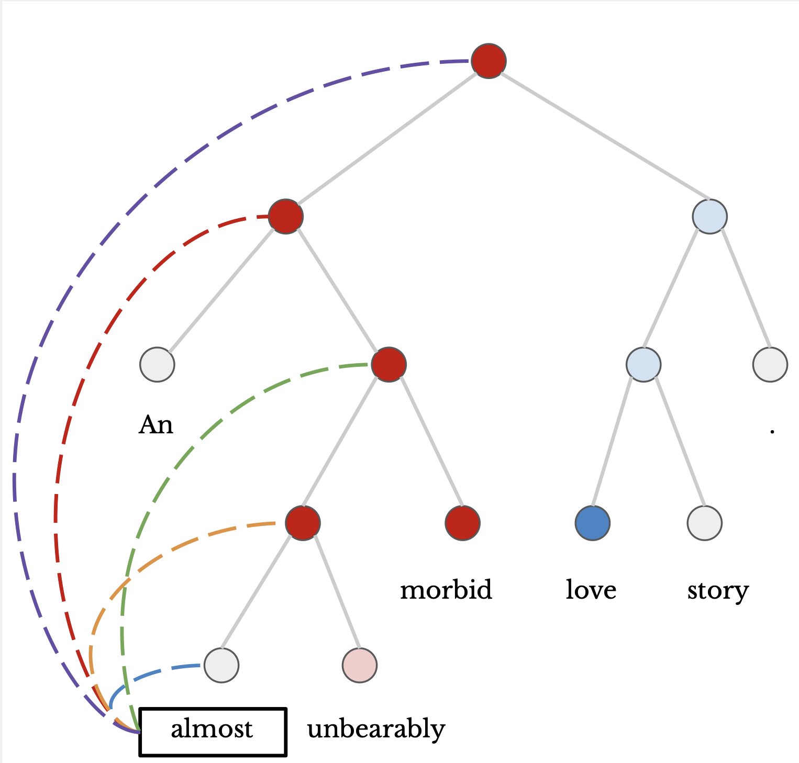
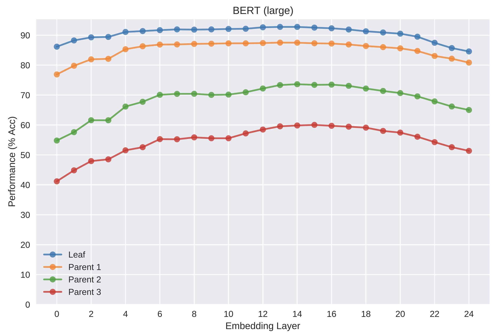
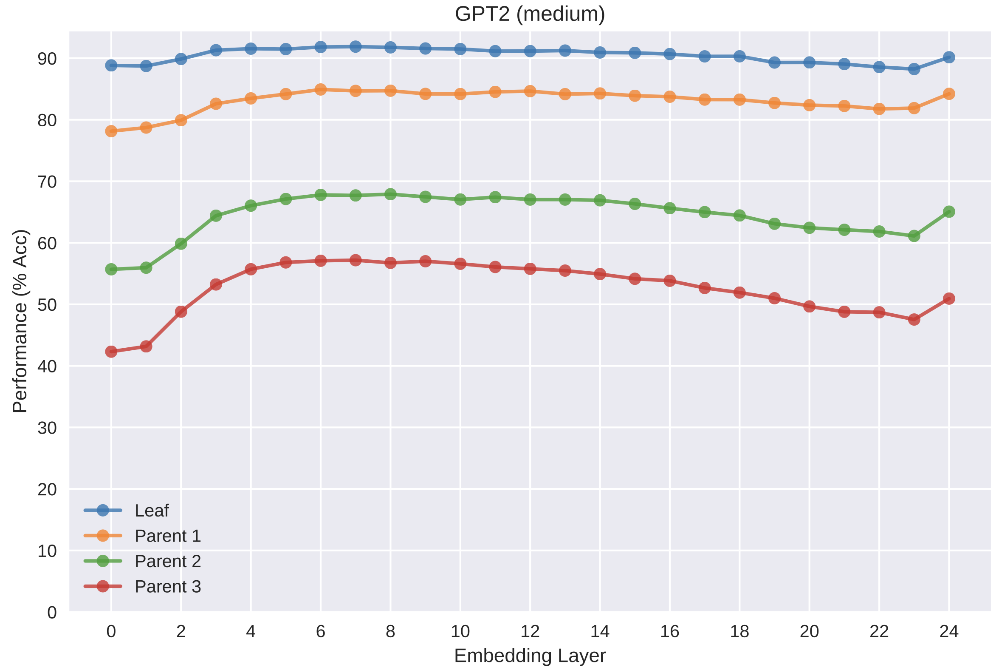

# **Linear Probing Tasks for Hierarchical Information in Word Representations**

This repository contains the official code for our study on the hierarchical information encoded in contextualized word embeddings from various pretrained transformer architectures. We train linear and nonlinear classifiers on single contextualized word embeddings using labeled constituency phrase trees to evaluate how different transformers capture syntactic and semantic features across multiple levels of a sentence. We particularly focus on evaluating differences between learned representations of autoencoding and autoregressive training strategies, such as BERT and GPT2, respectively. 

## Pretrained Contextualizers

The following pretrained contextualizers language models are used in this work:

- **Reformer (base)**: 12-layer, 768-hidden, 12-heads, 125M parameters

- **XLNet (base)**: 2-layer, 768-hidden, 12-heads, 110M parameters.
XLNet English model

- **GPT2 (medium)**:24-layer, 1024-hidden, 16-heads, 345M parameters.

- **GPT2 (base)**: 12-layer, 768-hidden, 12-heads, 117M parameters.
OpenAI GPT-2 English model

- **BERT (large, cased)**: 24-layer, 1024-hidden, 16-heads, 340M parameters.
Trained on cased English text.

- **BERT (base, cased)**: 12-layer, 768-hidden, 12-heads, 110M parameters.
Trained on cased English text: Wikipedia (~2.5B words) + BookCorpus (~800M words))

- **GloVe (840B.300d)**: (GloVe non-contextual baseline for comparison)

## **Example Results on Ancestor Sentiment Classification**

For a sequence of contextualized word representations, each token is tasked with predicting the sentiment classification of it's parent, grandparent, or great-grandparent. For cases where the token doesn't have a grandparent or great-grandparent, the linear model is tasked to predict a "None" classification label. Additionally, we perform sentence-level (root) sentiment analysis using single word representations contextualised on full sentences. We experiment with both fine-grained (5 classes) and binary, using the Stanford Sentiment Treebank (SST).

### Non-Transformer baselines

| Contextualizer              | Leaf    |Parent  | GParent | GGParent | Root     |
|:--------------------------- |:-------:|--------|:-------:|:--------:|:--------:|
|ELMo (original), layer 2     | 90.576  | 64.171  | 54.410  |**49.183**|**39.315**|
|ELMo (original), layer 1     |**91.598**|**64.060**|**54.205**| 48.319  | 38.101   |
|ELMo (original), layer 0     | 87.986  | 57.575  | 45.625  | 37.928  | 28.248   |
|||                                                                   |
|ELMo (5.5B), layer 2         | 90.133  | 63.860  | 54.766  | 49.567  | 41.181   |
|ELMo (5.5B), layer 1         | 91.131  | 64.244  | 54.818  | 49.621  | 39.341   |
|ELMo (5.5B), layer 0         | 91.326  | 59.647  | 47.692  | 40.117  | 29.307   |
|||                                                                   |
|GloVe (840B.300d)            | 90.274  | 60.278 | 47.526  | 39.963   | 28.808   |
*retest

### BERT (base, cased)

| Contextualizer              | Leaf    |Parent  | GParent | GGParent | Root     |
|:--------------------------- |:-------:|--------|:-------:|:--------:|:--------:|
|BERT (base, cased), layer 12 | 88.325  |62.693  | 53.289  | 48.154   | 41.155   |
|BERT (base, cased), layer 11 | 88.950  |62.934  | 53.343  | 48.165   | 40.978   |
|BERT (base, cased), layer 10 | 89.328  |63.123  | 53.653  | 48.272   | **41.256** |
|BERT (base, cased), layer 9  | 89.760  |**63.359**|**53.945**|**48.366**| 40.822   |
|BERT (base, cased), layer 8  | 90.204  |63.262  | 53.480  | 47.559   | 40.374   |
|BERT (base, cased), layer 7  | 90.926  |63.109  | 53.107  | 47.160   | 40.207   |
|BERT (base, cased), layer 6  | 91.314  |62.634  | 52.354  | 46.454   | 39.414   |
|BERT (base, cased), layer 5  | 91.656  |62.039  | 51.306  | 45.552   | 39.091   |
|BERT (base, cased), layer 4  | 91.923  |61.808  | 50.758  | 44.917   | 37.911   |
|BERT (base, cased), layer 3  | 92.157  |61.472  | 50.286  | 44.291   | 38.202   |
|BERT (base, cased), layer 2  | 92.383  |61.338  | 49.974  | 43.852   | 36.984   |
|BERT (base, cased), layer 1  | 92.848  |60.648  | 48.907  | 42.508   | 37.079   |
|BERT (base, cased), layer 0  | 92.829  |60.103  | 47.495  | 39.947   | 32.260   |

### GPT2 (base)

| Contextualizer              | Leaf    |Parent  | GParent | GGParent | Root     |
|:--------------------------- |:-------:|--------|:-------:|:--------:|:--------:|
|GPT2 (base), layer 0         | -       |61.54   | 49.79   | 43.88    | 29.32   |
|GPT2 (base), layer 1         | -       |61.57   | 50.49   | 46.06    | 31.40   |
|GPT2 (base), layer 2         | -       |61.63   | 50.63   | 46.70    | 31.59   |
|GPT2 (base), layer 3         | -       |61.65   | 51.41   | 47.37    | 32.46   |
|GPT2 (base), layer 4         | -       |61.94   | 52.13   | 48.08    | 32.09   |
|GPT2 (base), layer 5         | -       |61.99   | 52.65   | 48.62    | 32.55   |
|GPT2 (base), layer 6         | -       |62.03   | 53.38   | 48.91    | 33.33   |
|GPT2 (base), layer 7         | -       |62.29   | 52.99   | 48.39    | 33.00   |
|GPT2 (base), layer 8         | -       |62.07   | 52.75   | 49.29    | 33.99   |
|GPT2 (base), layer 9         | -       |61.90   | 52.74   | 48.90    | 34.26   |
|GPT2 (base), layer 10        | -       |61.42   | 51.89   | 48.11    | 33.92   |
|GPT2 (base), layer 11        | -       |60.55   | 50.45   | 46.74    | 33.16   |
|GPT2 (base), layer 12        | -       |**62.61**|**53.86**|**49.55**|**36.14**|

